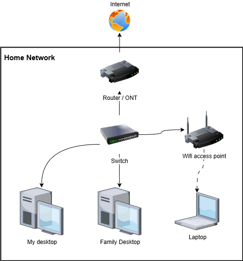

##### Intro
Initially the purpose of the blog was to assist me into organizing my ideas, support the creative process. 
However, right now, it is more a catalyzer, it accelerate new ideas generation, which is good but hope this does not derive me from my goal.
Below the list of ongoing topics.

##### The roadmap page
In order to keep somewhere all these new ideas, I have created a new Roadmap page with all my ideas.
For the moment, it is more a to do list than a roadmap, let's see how this evolves !
The [roadmap](/roadmap) page.

##### Network
To work on my blog and other personal projects, I use different computers depending on the time and location—whether I'm on the train, at my desk at home, or in the living room late at night.
While I can sync my code using Git, the inconsistency in development environments across devices can be a real challenge.

To solve this, I'm considering setting up a virtual machine hosted locally on a server, which would serve as a dedicated development environment.
One potential hurdle is making this machine accessible from outside my home network without exposing ports directly.
I’m thinking a reverse proxy might be the solution—though I still need to explore the best configuration.

##### Software Development
Currently using PowerApps I would like to give my feedback concerning the tool in a dedicated article.
